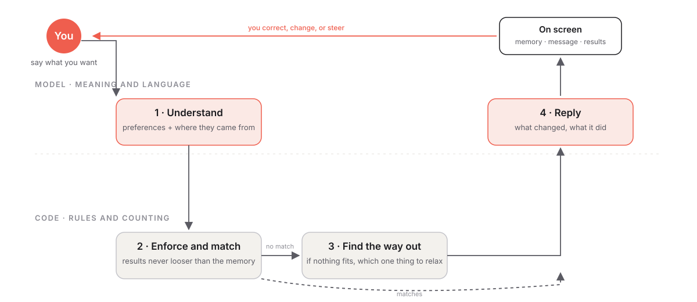

# Scout — Design rationale

Huzaifa Ratlam · Senior Product Designer

## The problem

Filters have one quiet advantage: the user wrote them. Nothing in a filter panel is a surprise. A conversational search does the opposite. It builds a picture of you from what you say and what you imply, with varying confidence, and that picture drifts as you talk. Unless it's designed for, the user never sees that picture. They end up arguing with results without knowing what they're arguing with.

So the real task was not "replace filters with chat". It was: **give the conversation a memory the user can read, question and change, and make sure nothing in it changes silently.**

## The theory: intent → understanding → results → refine

I designed Scout around one loop.

1. **Intent.** The person says what they want, in their own words, however incomplete.
2. **Understanding.** Scout forms a small set of preferences. Each one carries where it came from (*you said it*, *I'm assuming*, *I'm not sure*) and how long it lasts (*standing* or *just for now*).
3. **Results.** Listings reflect that understanding, and only that. If nothing fits, Scout names the single requirement that's blocking and what dropping it would give.
4. **Refine.** The person changes something, by talking or by touching the understanding directly. Scout says what changed and what it did. Back to step 2.

Two rules hold it together: **nothing changes silently**, and **what the user sees in the understanding is exactly what the results were built from**.

## The interaction

**A sticky understanding, not a filter panel.** The one thing a filter panel does well is being *always there*. I kept that and dropped the rest: a one-line summary of what Scout believes sits above the keyboard, in thumb reach, written in words rather than controls. Guesses are marked as guesses. Tap it and it reads as a sentence you can disagree with, phrase by phrase: *not important*, *change*, *why this?* Every correction goes back through the conversation, so the memory and the chat never disagree.

**Inference, with a spine.** An assistant that never infers is a form. One that infers silently is untrustworthy. Scout infers openly: "I have a dog" becomes a pet-friendly requirement because a dog can't live in a no-pets building, and Scout says it did that. "My office is in DIFC" only nudges the ranking; it never filters. Vague words ("nice area", "cheap") are never quietly interpreted; Scout asks.

**Results that answer the question you asked.** A listing card doesn't list amenities. Its tags are chosen from your preferences and state the fact: "480m from metro", "Pets allowed", "Unfurnished". Ask about schools and the card tells you the school and the distance. The card is the understanding, reflected back.

## How the model and the code share the job

Scout's job has two halves, and I designed them to be handled differently. Understanding a person is fuzzy work: reading "somewhere quiet, near my office" and turning it into something searchable. Showing results is exact work: a budget is a number, a pet-friendly building either is or isn't. So the conversation side is handled by the model, and the results side by ordinary code, with a clear hand-off between them.

1. **Understand** *(model)* — turns your message into preferences and where each came from.
2. **Match** *(code)* — applies them to the inventory; results can never be looser than what the memory shows.
3. **Find the way out** *(code)* — if nothing fits, works out which single requirement to relax and how many places that gives.
4. **Reply** *(model)* — says what changed and what's on screen, without questions, without recapping.

The memory on screen is the single source of truth: results are built from it and nothing else, and every change to it is spoken aloud once.

## Tone

Dubai's renters come from everywhere, and many aren't native English speakers. Scout is written for clarity over charm: short sentences, plain international English, no idioms, always the concrete thing (area, price, distance). It leads with what changed and doesn't recap; the understanding on screen already does that.

## Key decisions

| Decision | Why | What I gave up |
|---|---|---|
| Conversation with a visible memory, not filters in disguise | The problem is legibility of a machine's model of you; a filter drawer avoids the problem rather than solving it | The comfort of a familiar pattern |
| Provenance on every preference (said / assumed / unsure) | People forgive a wrong guess if it's labelled as one; they don't forgive being told they said something they didn't | Simplicity of a flat list |
| Inference that applies necessities and only ranks wishes | Never inferring makes a form; inferring silently breaks trust; this is the honest middle | Occasionally acting on something unsaid, always announced |
| No quick-reply chips anywhere | Chips are filters by another name; the conversation should stay a conversation | Speed of answering |
| Clarity over charm in language | The audience is the UAE's expat population, not native English readers | Warmth |
| Seeded inventory, stated plainly | No legitimate live source exists for a prototype; seeding let me design the inventory to exercise the interaction | Realism at the edges |

## What's next: voice is the next UI

Everything in Scout was designed so that speech is just another way in. A preference is a preference whether it was typed or said; the memory is visible either way; a correction is a sentence in either modality. The next step is not a voice feature but voice as the default: say what you want, glance at what Scout understood, correct it out loud. The screen becomes the place you check, and the conversation becomes the place you decide.
